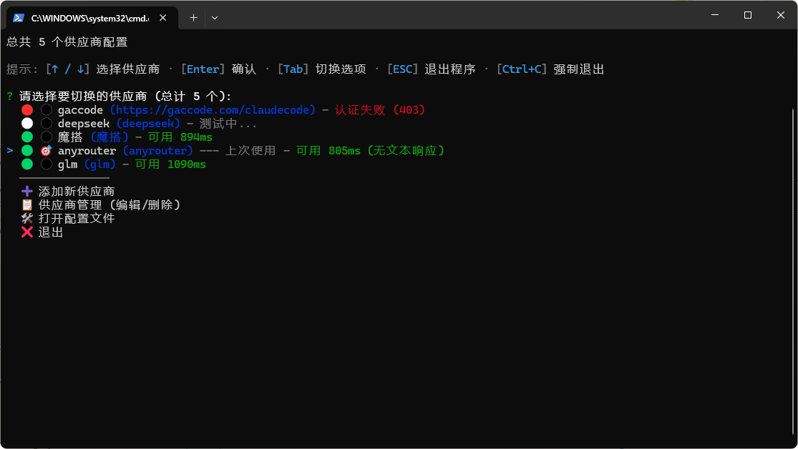
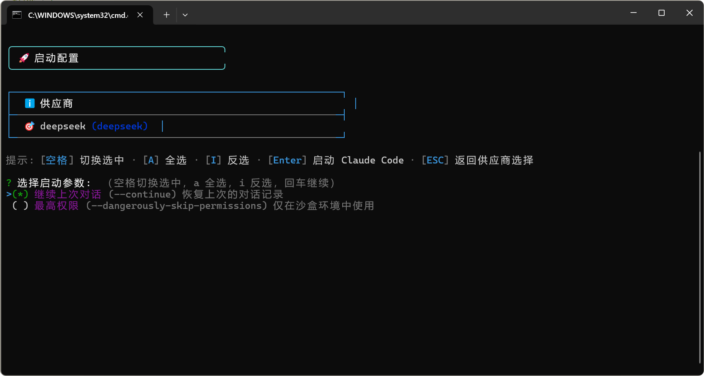
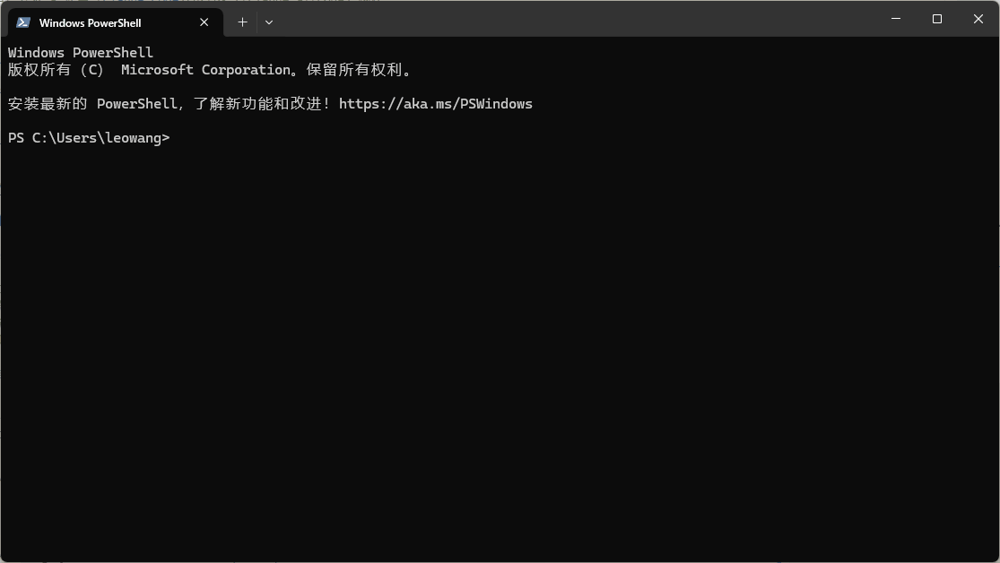

# Claude Code 环境切换器

一键切换 Claude Code 的 API 供应商,让你轻松管理多个账号配置。

> 🤖 本项目完全由 AI 开发 - 使用 [Claude Code](https://claude.ai/code) 构建

## 📸 界面预览

### 主界面 - 供应商选择


### 启动配置界面


### 使用演示


## 💡 这个工具是干什么的？

如果你在使用 Claude Code 时遇到这些问题：

- ✅ 需要在多个 API 供应商之间切换
- ✅ 使用不同的账号或 Token
- ✅ 需要配置第三方代理服务
- ✅ 想要快速保存和切换多套配置

那这个工具就是为你准备的！只需要一条命令 `cc`，就能快速切换环境。

## 🚀 快速开始

### 第一步：安装工具

打开终端(命令行),运行：

```bash
npm install -g @wcldyx/claude-code-switcher
```

### 第二步：添加你的第一个供应商

```bash
cc add
```

根据提示输入：
1. **名称**：给这个配置起个名字,比如 "官方账号"、"代理服务" 等
2. **认证方式**：选择你使用的 Token 类型
3. **Token**：粘贴你的 API Token
4. **基础 URL**（可选）：如果使用第三方服务需要填写

### 第三步：开始使用

```bash
cc
```

用方向键选择要使用的供应商,按回车确认,工具会自动启动 Claude Code！

## 📖 常用命令

```bash
cc              # 打开选择界面,切换供应商
cc add          # 添加新的供应商配置
cc list         # 查看所有已保存的供应商
cc current      # 查看当前正在使用哪个供应商
cc edit         # 修改某个供应商的配置
cc remove       # 删除不需要的供应商
```

## ✨ 主要功能

### 🔄 智能环境切换
- 一键切换多个 Claude Code 供应商配置
- 支持官方和第三方 API 服务商
- 自动管理环境变量,无需手动配置

### 🛡️ 冲突检测与处理
- **自动检测** Claude 设置文件中的环境变量冲突
- **智能备份** 在修改前自动创建配置备份
- **安全清理** 清空冲突变量,确保切换成功

### 🚀 启动参数配置
- 支持 `--continue` 参数继续上次对话
- 支持 `--dangerously-skip-permissions` 沙盒模式
- 灵活选择启动参数组合

### 📡 实时状态检测
- **流式检测** 供应商可用性实时检查,逐个显示结果
- **状态指示** 使用彩色图标直观显示供应商状态(🟢可用 / 🟡有限可用 / 🔴不可用)
- **延迟显示** 实时显示 API 响应延迟,帮助选择最快的服务
- **智能识别** 自动识别不同供应商的响应格式,兼容性强
- **异步更新** 状态检测不阻塞界面操作,边检测边选择

### ⌨️ 优化的键盘操作
- **ESC 键** - 快速返回上一级菜单
- **Ctrl+C** - 随时强制退出程序
- **方向键** - 便捷的菜单导航
- **空格/A/I** - 多选操作(全选/反选)

### 📊 使用统计
- 记录每个供应商的使用次数
- 显示最后使用时间
- 智能推荐常用供应商

## 🎯 使用场景示例

### 场景1：工作和个人账号切换

```bash
# 上班时使用公司账号
cc 公司账号

# 下班后切换到个人账号
cc 个人账号
```

### 场景2：使用第三方服务

有些第三方服务提供 Claude API 代理,你可以这样配置：

```bash
cc add
# 输入名称: 第三方服务
# 选择认证方式: API 密钥模式
# 输入 API 密钥: 粘贴你的密钥
# 输入基础 URL: https://api.third-party.com
```

### 场景3：临时测试新服务

```bash
# 添加测试配置
cc add

# 试用一下
cc 测试服务

# 不好用就删掉
cc remove 测试服务
```

## ⚙️ 认证方式说明

添加供应商时,会让你选择认证方式,这里简单说明：

**1. OAuth 令牌模式** (最常用)
- 适用于官方 Claude Code
- Token 格式: `sk-ant-oat01-...`
- 只需要填 Token,不需要填 URL

**2. API 密钥模式**
- 适用于第三方服务商
- 需要填写 API 密钥和服务商提供的 URL

**3. 认证令牌模式**
- 适用于某些第三方服务商
- 需要填写认证令牌和服务商提供的 URL

> 💡 不确定选哪个？看你的 Token 是什么格式,或者咨询你的服务商。

## ❓ 常见问题

**Q: 我的 Token 存在哪里,安全吗？**
A: 配置保存在你的电脑上 `~/.cc-config.json`,只有你能访问。Token 会被加密存储。

**Q: 什么是"环境变量冲突检测"？**
A: 如果你在 Claude Code 的设置文件（`.claude/settings.json` 或 `.claude/settings.local.json`）中配置了环境变量，这些变量可能会覆盖本工具设置的供应商配置。工具会自动检测这种冲突，并提示你备份和清理冲突的变量。

**Q: 备份文件保存在哪里？**
A: 备份文件保存在原设置文件的同目录下，命名格式为 `settings.backup-YYYYMMDD_HHmmss.json`，方便你随时恢复。

**Q: 状态检测是如何工作的？**
A: 工具会向每个供应商的 API 发送一个简单的测试请求,根据响应时间和结果显示状态。🟢表示可用,🟡表示有限可用(响应慢或部分功能受限),🔴表示不可用,⏳表示正在检测中。状态检测采用流式模式,逐个显示结果,不会阻塞界面操作。

**Q: 为什么某些供应商显示"暂不支持 OAuth 令牌检测"？**
A: OAuth 令牌模式的供应商(官方 Claude Code)暂不支持状态检测,因为 OAuth 认证流程比较复杂。工具只对使用 API 密钥或认证令牌的第三方供应商进行状态检测。

**Q: 如何重新来过？**
A: 删除配置文件 `~/.cc-config.json` 就会清空所有配置。

**Q: 可以导出配置到其他电脑吗？**
A: 可以！复制 `~/.cc-config.json` 文件到新电脑的相同位置即可。

**Q: 按 ESC 键没反应？**
A: 确保你的终端支持 ESC 键捕获。如果不行，使用 `Ctrl+C` 也可以退出程序。

**Q: 需要什么系统？**
A: Windows、macOS、Linux 都支持。需要安装 Node.js 14 或更高版本。

**Q: 启动参数有什么用？**
A: `--continue` 可以继续上次的对话，`--dangerously-skip-permissions` 适合在沙盒环境中使用（跳过权限检查）。你可以在启动时灵活选择需要的参数。

## 📝 更新日志

### v1.0.13 (最新)
- ✨ 实现供应商状态流式检测和实时更新
- 📡 将批量检测改为流式模式,逐个显示状态结果
- 🎨 优化状态图标显示,支持实时延迟展示
- 🚀 增强UI交互,支持动态更新选择界面
- 🔧 改进异步调度逻辑,提升响应速度

### v1.0.12
- ✨ 新增供应商状态检测功能
- 📡 添加 ProviderStatusChecker 类用于检测供应商可用性
- 🎨 在供应商列表和选择界面显示实时状态信息
- 🟢 支持状态图标显示(可用/有限可用/不可用)和延迟时间展示
- 🚀 异步更新状态不阻塞界面操作

### v1.0.9
- ✨ 新增 Claude 设置文件冲突检测功能
- 🛡️ 自动备份和清理冲突的环境变量
- ⌨️ 增强 ESC 键处理系统，支持各层级快速返回
- 🎨 改进输入提示行为和屏幕清空功能
- 🔧 重构 Windows 支持模块，提升跨平台兼容性

### v1.0.8
- 🎯 优化用户界面和交互体验
- 📊 改进供应商使用统计功能

## 🆘 遇到问题？

1. 查看 [常见问题](https://github.com/wcldyx/claude-code-switcher/issues)
2. 提交 [新问题](https://github.com/wcldyx/claude-code-switcher/issues/new)

---

## 🤖 关于本项目

本项目完全由 AI 使用 [Claude Code](https://claude.ai/code) 开发完成。

**Claude Code Switcher** - 让环境切换变得简单 🚀
