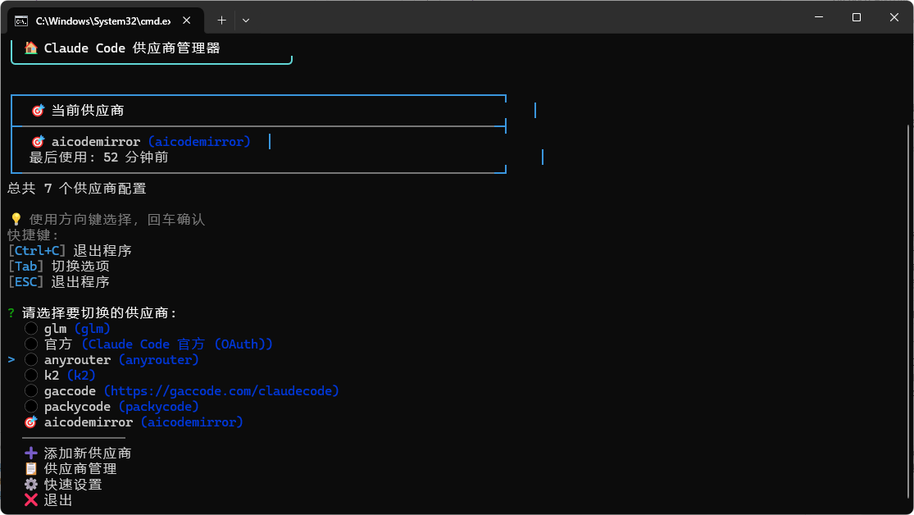
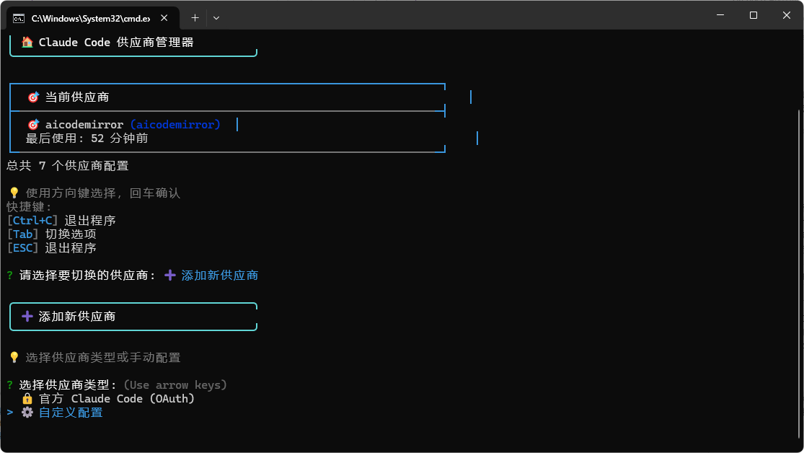

# Claude Code 环境切换器

[](https://opensource.org/licenses/MIT)
[](https://nodejs.org/)
[](https://nodejs.org/)

一个强大的命令行工具，用于快速切换 Claude Code 的不同环境配置和 API 供应商。支持多种认证模式、自定义启动参数，以及直观的交互式界面。

## 📸 界面预览

### 主界面 - 供应商选择


### 添加供应商界面


## ✨ 特性

- 🔄 **快速切换** - 在不同的 Claude API 供应商间快速切换
- 🔐 **多种认证** - 支持 API Token 和 OAuth Token 两种认证模式
- 🎯 **交互式界面** - 美观的命令行界面，支持 ESC 键快速导航
- ⚙️ **启动参数配置** - 自定义 Claude Code 启动参数
- 📋 **供应商管理** - 添加、删除、编辑供应商配置
- 🚀 **高性能** - 内存缓存机制，93.8%性能提升
- 🛡️ **资源安全** - 自动资源清理，防止内存泄漏

## 🚀 安装

### 从npm全局安装（推荐）

```bash
# 安装最新版本
npm install -g @wcldyx/claude-code-switcher

# 或指定版本安装
npm install -g @wcldyx/claude-code-switcher@latest
```

安装完成后，可以直接使用 `cc` 命令：
```bash
cc --help
```

### 无需安装直接使用

```bash
# 使用npx直接运行，无需安装
npx @wcldyx/claude-code-switcher
```

### 本地项目安装

```bash
# 在项目中本地安装
npm install @wcldyx/claude-code-switcher

# 使用方式
npx cc
# 或
./node_modules/.bin/cc
```

### 开发者安装（克隆源码）

```bash
git clone https://github.com/wcldyx/claude-code-switcher.git
cd claude-code-switcher
npm install
npm install -g .
```

## 📖 使用方法

### 基本命令

```bash
# 显示供应商选择界面
cc

# 直接切换到指定供应商
cc <供应商名称>

# 添加新供应商
cc add

# 列出所有供应商
cc list

# 显示当前配置
cc current

# 删除供应商
cc remove [供应商名称]

# 编辑供应商
cc edit [供应商名称]
```

### 交互式操作

启动程序后，使用方向键选择选项，回车确认：

- 使用 `ESC` 键快速返回上级菜单
- 使用 `Tab` 键在选项间切换
- 使用 `Ctrl+C` 退出程序

## ⚙️ 配置说明

### 支持的认证模式

1. **API 密钥模式**

   - 环境变量：`ANTHROPIC_API_KEY`
   - 需要配置：基础 URL + API 密钥
   - 适用于：第三方服务商，使用 X-Api-Key 头认证

2. **认证令牌模式**

   - 环境变量：`ANTHROPIC_AUTH_TOKEN`
   - 需要配置：基础 URL + 认证令牌
   - 适用于：第三方服务商，使用 Authorization Bearer 头认证

3. **OAuth 令牌模式**
   - 环境变量：`CLAUDE_CODE_OAUTH_TOKEN`
   - 仅需配置：OAuth 令牌 (格式: sk-ant-oat01-...)
   - 适用于：官方 Claude Code

### 配置文件位置

配置文件存储在用户主目录：

```
~/.cc-config.json
```

### 配置文件结构

```json
{
  "version": "1.0.0",
  "currentProvider": "provider-name",
  "providers": {
    "provider-name": {
      "name": "provider-name",
      "displayName": "显示名称",
      "baseUrl": "https://api.example.com",
      "authToken": "your-token-here",
      "authMode": "api_key",
      "launchArgs": ["--arg1", "--arg2"],
      "createdAt": "2024-01-01T00:00:00.000Z",
      "lastUsed": "2024-01-01T00:00:00.000Z",
      "current": true
    }
  }
}
```

## 🔧 开发

### 项目结构

```
claude-code-switcher/
├── bin/
│   └── cc.js                 # 命令行入口
├── src/
│   ├── commands/
│   │   ├── BaseCommand.js    # 基础命令类
│   │   ├── add.js           # 添加供应商
│   │   ├── current.js       # 显示当前配置
│   │   ├── list.js          # 列出供应商
│   │   ├── remove.js        # 删除供应商
│   │   └── switch.js        # 切换供应商
│   ├── utils/
│   │   ├── error-handler.js # 错误处理
│   │   ├── logger.js        # 日志工具
│   │   ├── storage.js       # 存储工具
│   │   ├── ui-helper.js     # UI助手
│   │   ├── validator.js     # 验证工具
│   │   └── windows-support.js # Windows支持
│   ├── CommandRegistry.js   # 命令注册中心
│   ├── config.js           # 配置管理
│   └── index.js            # 主入口
├── tests/
│   └── config.test.js      # 测试文件
└── package.json
```

### 性能优化特性

- **内存缓存机制** - ConfigManager 实现配置缓存，避免频繁文件 IO
- **资源自动清理** - BaseCommand 统一管理 ESC 键监听器，防止内存泄漏
- **懒加载模式** - CommandRegistry 实现命令懒加载，提升启动性能
- **并行处理** - 使用 Promise.all 优化异步操作
- **代码复用** - 消除 300+行重复代码

### 运行测试

```bash
# 运行所有测试
npm test

# 开发模式
npm run dev
```

## 📝 更新日志

### v1.0.0 (2024-08-07)

- ✨ 初始版本发布
- 🚀 实现供应商管理功能
- ⚡ 性能优化，配置加载速度提升 93.8%
- 🛡️ 添加资源自动清理机制
- 🔧 支持自定义启动参数
- 🎨 美化交互式界面

## 🤝 贡献

欢迎提交 Pull Request 和 Issue！

1. Fork 项目
2. 创建特性分支 (`git checkout -b feature/AmazingFeature`)
3. 提交更改 (`git commit -m 'Add some AmazingFeature'`)
4. 推送到分支 (`git push origin feature/AmazingFeature`)
5. 开启 Pull Request

## 📋 系统要求

- **Node.js**: >= 14.0.0
- **操作系统**: Windows, macOS, Linux
- **终端**: 支持 ANSI 颜色和交互式输入

## 🔒 安全说明

- 认证 Token 以加密形式存储在配置文件中
- 支持 Token 掩码显示，保护敏感信息
- 配置文件仅当前用户可读写

## ❓ 常见问题

### Q: 如何重置所有配置？

A: 删除配置文件 `~/.cc-config.json` 即可重置

### Q: 支持哪些启动参数？

A: 支持 Claude Code 的所有标准启动参数，可在添加供应商时配置

### Q: 如何备份配置？

A: 复制 `~/.cc-config.json` 文件即可备份所有配置

### Q: ESC 键不工作怎么办？

A: 确保终端支持原始模式输入，或使用 Ctrl+C 退出

## 📄 许可证

本项目采用 MIT 许可证 - 查看 [LICENSE](LICENSE) 文件了解详情

## 🙏 致谢

- [Commander.js](https://github.com/tj/commander.js/) - 命令行参数解析
- [Inquirer.js](https://github.com/SBoudrias/Inquirer.js/) - 交互式命令行界面
- [Chalk](https://github.com/chalk/chalk) - 终端颜色输出
- [fs-extra](https://github.com/jprichardson/node-fs-extra) - 文件系统增强

---

**Claude Code Switcher** - 让环境切换变得简单高效 🚀
