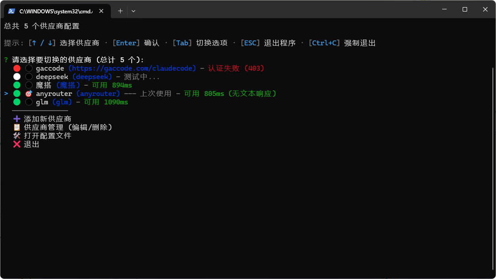
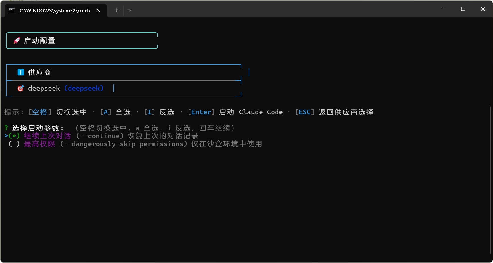
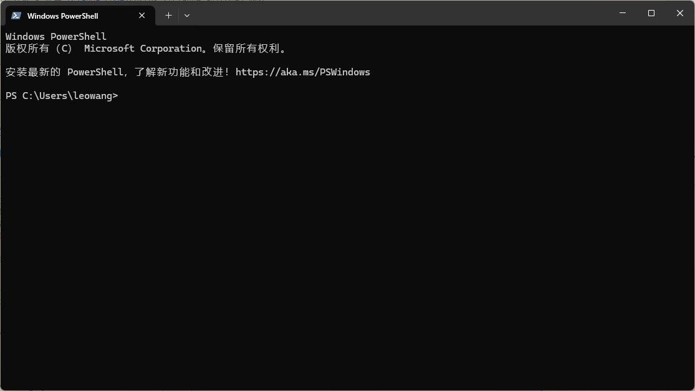

# Claude Code 环境切换器

一键切换 Claude Code 的 API 供应商，管理官方账号、第三方服务商、中转 API、模型别名和启动参数。

[English](./README.en.md)

> 本项目由 AI 使用 [Claude Code](https://claude.ai/code) 辅助开发。

## 界面预览

### 主界面



### 启动配置



### 使用演示



## 适合谁

如果你需要：

- 在多个 Claude Code API 供应商之间切换
- 保存多个账号、Token 或第三方 API 配置
- 给不同供应商设置不同的模型别名
- 直启 Claude Code，并自动带上常用启动参数
- 检测 `.claude/settings.json` 里的环境变量冲突

这个工具可以把这些配置集中到 `~/.cc-config.json`，用一条 `cc` 命令切换。

## 安装

```bash
npm install -g @wcldyx/claude-code-switcher
```

运行：

```bash
cc
```

选择供应商后，工具会设置对应环境变量并启动 Claude Code。

## 常用命令

```bash
cc                         # 打开选择界面
cc <供应商名>               # 直接启动该供应商
cc <供应商名> [参数...]      # 直接启动，并透传 Claude Code 参数
cc add                     # 添加供应商
cc list                    # 查看供应商
cc current                 # 查看当前配置
cc edit                    # 编辑供应商
cc remove                  # 删除供应商
```

示例：

```bash
cc 公司账号
cc 公司账号 --continue
cc 公司账号 --print "你好"
```

`cc` 只负责设置环境变量和转发启动参数，不改变 Claude Code 官方参数的语义。

## 语言

工具会根据系统语言自动选择中文或英文。也可以通过环境变量强制指定：

```bash
CC_LANG=en cc
CC_LANG=zh-CN cc
```

当前 CLI 帮助、顶层错误和更新提示已支持中英文；交互式菜单文案会继续逐步抽取。

## 支持的认证方式

### API 密钥模式

适合大多数第三方服务商。

设置：

```text
ANTHROPIC_BASE_URL
ANTHROPIC_API_KEY
```

### 认证令牌模式

适合使用 Anthropic auth token 兼容方式的服务商。

设置：

```text
ANTHROPIC_BASE_URL
ANTHROPIC_AUTH_TOKEN
```

### OAuth 令牌模式

适合官方 Claude Code OAuth。

设置：

```text
CLAUDE_CODE_OAUTH_TOKEN
```

OAuth 模式不需要 `ANTHROPIC_BASE_URL`。

## 模型配置

工具使用 Claude Code 新版默认模型环境变量：

```text
ANTHROPIC_DEFAULT_OPUS_MODEL
ANTHROPIC_DEFAULT_SONNET_MODEL
ANTHROPIC_DEFAULT_HAIKU_MODEL
```

添加或编辑供应商时，可以分别配置 Opus、Sonnet、Haiku 三个模型别名。

旧配置会自动迁移：

```text
models.primary   -> models.sonnet
models.smallFast -> models.haiku
```

工具不会再设置旧的 `ANTHROPIC_MODEL` 和 `ANTHROPIC_SMALL_FAST_MODEL`。

## 运行时上下文配置

工具会为 Claude Code 设置运行时环境变量，默认上下文窗口为 258k tokens：

```text
CLAUDE_CODE_AUTO_COMPACT_WINDOW=258000
CLAUDE_AUTOCOMPACT_PCT_OVERRIDE=70
BASH_MAX_OUTPUT_LENGTH=12000
TASK_MAX_OUTPUT_LENGTH=16000
```

这些值保存在每个供应商的 `runtimeEnv` 配置中，可以通过编辑供应商调整。

## 连接测试

供应商状态检测会发送一个轻量请求探活。模型选择遵循“先读用户配置，再按便宜优先”的规则：

```text
用户配置的 Haiku
ANTHROPIC_DEFAULT_HAIKU_MODEL
用户配置的 Sonnet
ANTHROPIC_DEFAULT_SONNET_MODEL
用户配置的 Opus
ANTHROPIC_DEFAULT_OPUS_MODEL
内置默认 Haiku
```

OAuth 令牌模式暂不做连接测试。

## 启动参数

支持保存和透传 Claude Code 启动参数，例如：

```text
--continue
--dangerously-skip-permissions
```

默认情况下，“最高权限”参数会被默认勾选，并且 `cc <供应商名>` 直启时会自动带上：

```text
--dangerously-skip-permissions
```

如果想关闭这个默认行为，编辑 `~/.cc-config.json`：

```json
{
  "preferences": {
    "defaultDangerouslySkipPermissions": false
  }
}
```

关闭后：

- 交互界面不会默认勾选最高权限
- `cc <供应商名>` 不会自动追加最高权限
- 如果某个供应商自己的 `launchArgs` 已显式保存该参数，仍会生效

## 配置文件

配置保存在：

```text
~/.cc-config.json
```

示例结构：

```json
{
  "version": "1.0.0",
  "currentProvider": "deepseek",
  "preferences": {
    "defaultDangerouslySkipPermissions": true
  },
  "providers": {
    "deepseek": {
      "name": "deepseek",
      "displayName": "DeepSeek",
      "authMode": "api_key",
      "baseUrl": "https://api.example.com",
      "authToken": "your-token",
      "launchArgs": [],
      "models": {
        "opus": null,
        "sonnet": "deepseek-chat",
        "haiku": "deepseek-chat"
      }
    }
  }
}
```

注意：Token 保存在本机 JSON 文件中，请保护好这个文件，不要提交到 Git 或发送给他人。

## 环境变量冲突检测

如果 `.claude/settings.json` 或 `.claude/settings.local.json` 中写了同名环境变量，可能会覆盖本工具设置的供应商配置。

工具会检测并提示备份、清理这些冲突变量：

```text
ANTHROPIC_API_KEY
ANTHROPIC_AUTH_TOKEN
ANTHROPIC_BASE_URL
CLAUDE_CODE_OAUTH_TOKEN
ANTHROPIC_DEFAULT_OPUS_MODEL
ANTHROPIC_DEFAULT_SONNET_MODEL
ANTHROPIC_DEFAULT_HAIKU_MODEL
CLAUDE_CODE_AUTO_COMPACT_WINDOW
CLAUDE_AUTOCOMPACT_PCT_OVERRIDE
BASH_MAX_OUTPUT_LENGTH
TASK_MAX_OUTPUT_LENGTH
```

备份文件命名格式：

```text
settings.backup-YYYYMMDD_HHmmss.json
```

## 常见问题

**Q: 第三方 DeepSeek / 中转 API 能用 Chrome 集成吗？**  
A: 不能。Claude Code 的 Chrome 集成依赖官方账号和官方服务链路，第三方 provider 场景下不适用，所以本工具不再提供 `--chrome` 启动选项。

**Q: Token 是否加密？**  
A: 不是。配置保存在本机 `~/.cc-config.json`，请自行保护文件权限。

**Q: 如何重置配置？**  
A: 删除 `~/.cc-config.json` 后重新运行 `cc add`。

**Q: 可以迁移到另一台电脑吗？**  
A: 可以，复制 `~/.cc-config.json` 到新电脑相同位置即可。

**Q: 需要什么系统？**  
A: Windows、macOS、Linux 都支持，需要 Node.js 14 或更高版本。

## 更新日志

### v2.0.0

- 移除第三方场景无效的 `--chrome` 启动选项
- 支持新版 Opus / Sonnet / Haiku 默认模型变量
- 移除旧模型变量输出
- 支持通过 JSON 配置关闭默认最高权限
- `cc <供应商名>` 直启默认应用最高权限参数
- 连接测试按 Haiku -> Sonnet -> Opus 顺序选择最便宜可用模型
- 优化启动性能：懒加载交互模块、SDK 和启动器，更新检查后台执行
- 优化 Windows Ctrl+C 退出：恢复控制台模式并清理残留输出
- 缓存 Windows Claude Code 启动路径，减少确认启动后的同步等待
- 新增英文文档 `README.en.md`
- 新增多语言基础支持，CLI 帮助和更新提示可按系统语言显示中文或英文

### v1.0.24

- 修复和改进供应商配置管理

### v1.0.13

- 实现供应商状态流式检测和实时更新
- 将批量检测改为流式模式，逐个显示状态结果
- 优化状态图标显示，支持实时延迟展示

### v1.0.9

- 新增 Claude 设置文件冲突检测
- 自动备份和清理冲突环境变量
- 增强 ESC 键处理系统

## 反馈

- [Issues](https://github.com/wcldyx/claude-code-switcher/issues)
- [New issue](https://github.com/wcldyx/claude-code-switcher/issues/new)
